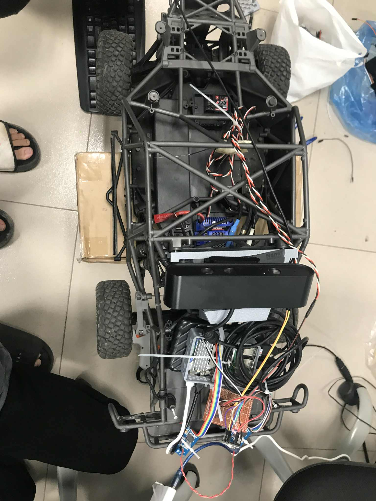

# 🚗 Autonomous Human-Following Robot Car (Raspberry Pi 5)



**Mục tiêu:** Xe/robot di động tự hành **bám theo người** (human-following) sử dụng Astra, mô hình phát hiện đối tượng (ONNX/PyTorch) và bộ theo dõi OCSort.  
Dự án được xây dựng dưới dạng package ROS2 và hướng tới chạy trên **Raspberry Pi 5**.


## 🧩 Tổng quan kiến trúc


- **ROS2 nodes**
  - `camera_publisher` — đọc depth + color từ camera (OpenNI / Astra) và publish lên topic `color_image` / `depth_image`.
  - `tracking` — nhận ảnh, chạy phát hiện, vẽ bounding box, có phần hiển thị (cv2.imshow).
  - `postProcess` — xử lý hậu (ONNX + OCSort) để tạo các track ổn định.
  - `get_control` — giao tiếp CAN (`python-can`, `socketcan`) để điều khiển tốc độ/góc lái của xe.

- **Theo dõi:** OCSort (thư mục `bramy/ocsort`) được tích hợp để theo dõi nhiều đối tượng, chọn target bám theo, và trả về tọa độ trung tâm / offset để điều khiển xe.

---

## ⚙️ Yêu cầu phần cứng (Hardware)

| Thành phần | Mô tả |
|-------------|-------|
| **Raspberry Pi 5** | Bộ xử lý chính chạy ROS2 |
| **Astra Depth Camera** | Cảm biến RGB-D hỗ trợ OpenNI |
| **Motor Driver (CAN bus)** | Bộ điều khiển động cơ hỗ trợ giao tiếp CAN |
| **CAN Interface** | USB-CAN hoặc MCP2515 (SPI) |
| **Nguồn cấp** | Đảm bảo đủ dòng cho Pi + động cơ |

---

## 🧠 Yêu cầu phần mềm (Packages chính)

- ROS2 **Jazzy** hoặc phiên bản tương thích trên Raspberry Pi
- Python packages:
  - `rclpy`, `sensor_msgs`, `std_msgs`, `cv_bridge` (ROS2)
  - `opencv-python`, `numpy`
  - `onnxruntime`, `torch`
  - `openni` (bindings cho camera Astra)
  - `python-can`
- Hệ thống: `colcon` để build ROS2 workspace

---

## 🗂️ Cấu trúc chính của repository
rclpy/
car/
bramy/
camera/
astra_camera.py # wrapper OpenNI camera (depth + color)
camera_publisher.py # node publish color/depth topic
get_control.py # node tương tác CAN -> publish control
tracking.py # node nhận ảnh, phát hiện, hiển thị
PostProcess.py # hậu xử lý + OCSort + onnx runtime
ocsort/ # implementation OCSort (tracker)
launch/bramy.launch.py # launch file cho 4 node chính
package.xml, setup.py, ... # ROS2 package metadata
README.md
LICENSE


---

## 🧩 Cách build & chạy (trên Raspberry Pi 5)

> Giả sử bạn đã cài ROS2 (jazzy hoặc release tương ứng), `colcon`, và thiết lập workspace.

### 1️⃣ Build project

```bash
cd ~/ros2_ws
colcon build
source /opt/ros/jazzy/setup.bash
source install/setup.bash

# Test bằng vcan (no hardware)
sudo modprobe vcan
sudo ip link add dev vcan0 type vcan
sudo ip link set up vcan0

# Nếu dùng USB-CAN hoặc MCP2515 thật
sudo ip link set can0 up type can bitrate 500000


